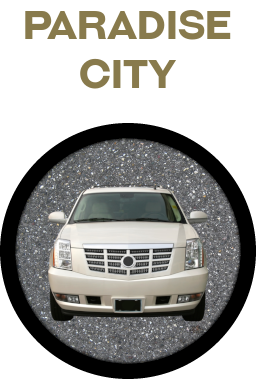
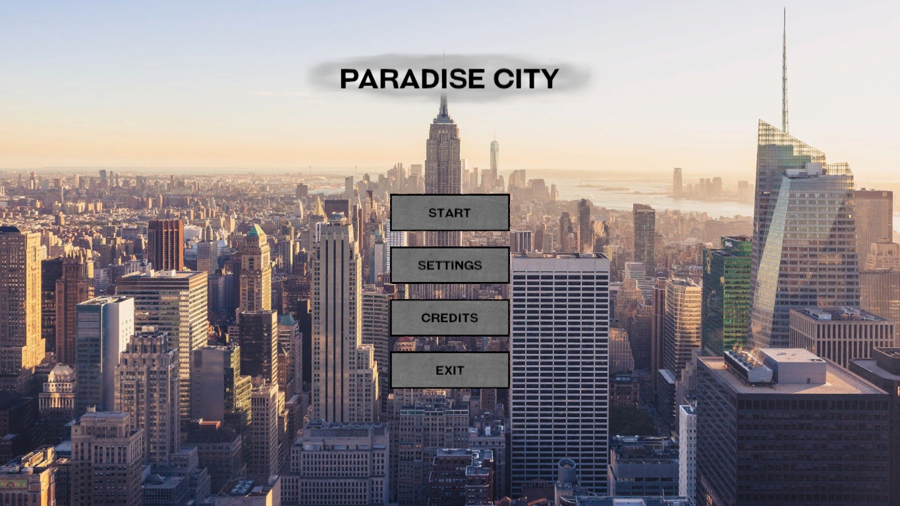
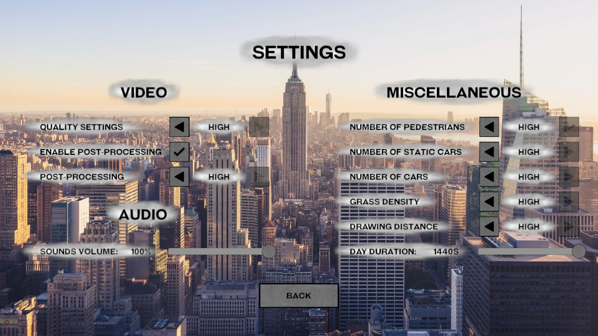
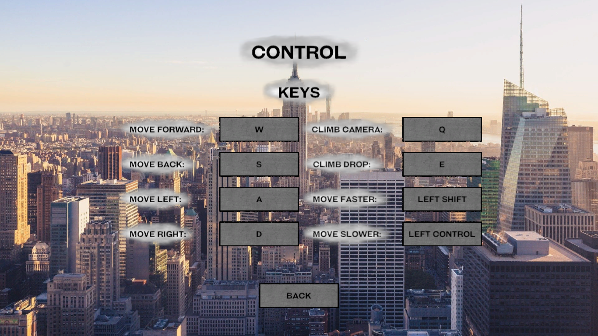
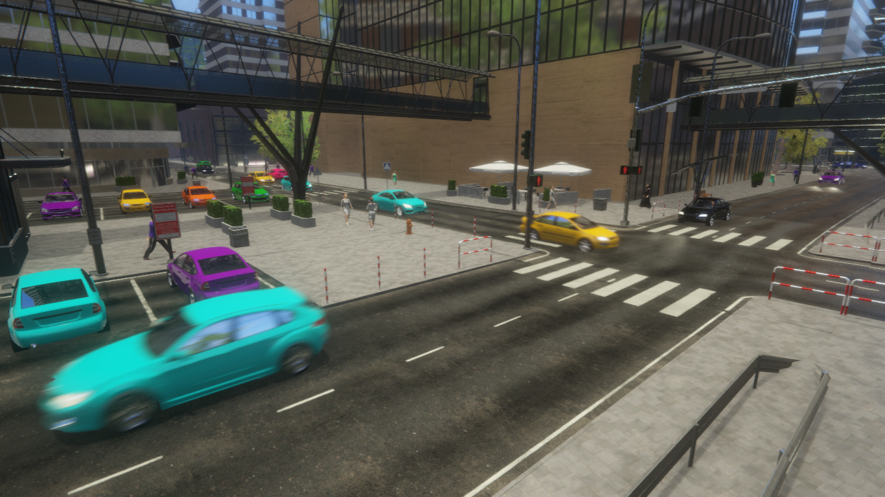
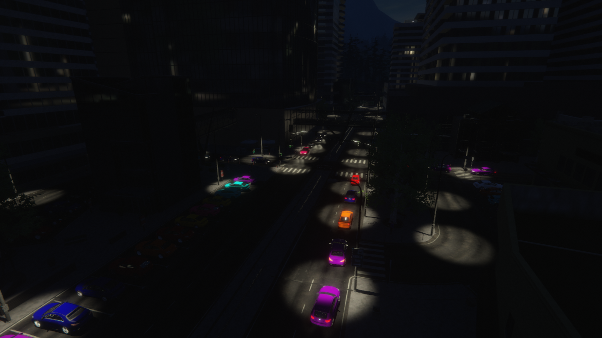
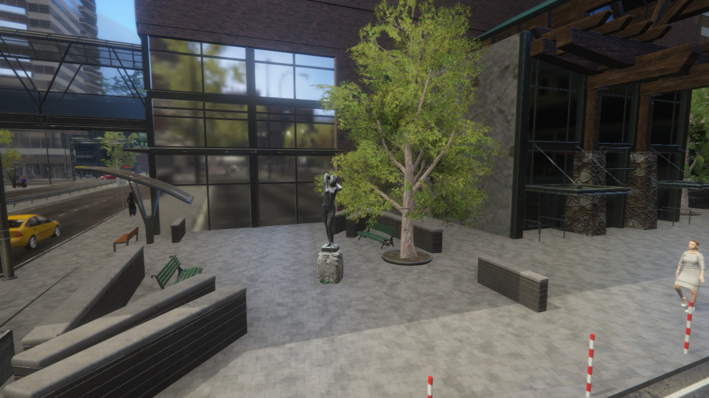
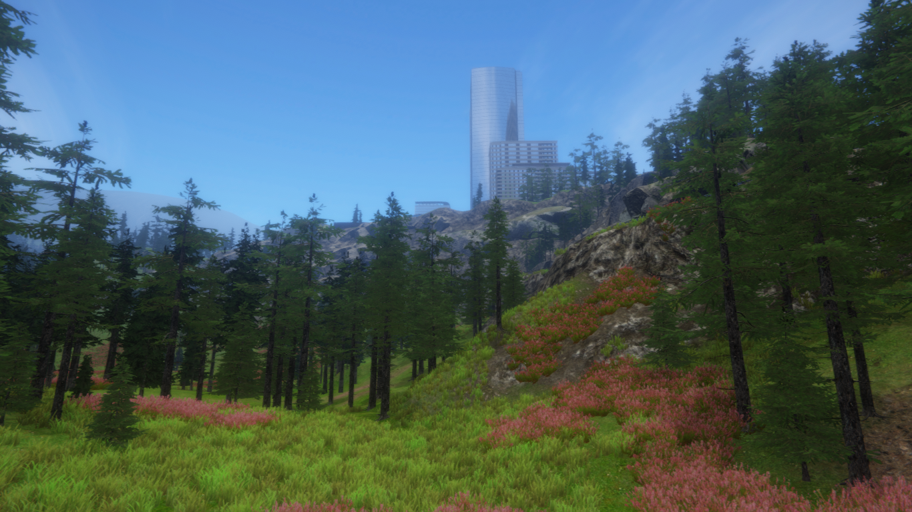

  

## Abstract

Paradise City is a real-time simulation which presents behaviors occur in big city. In the project many actions are performing independently of each other. The main goal is created the full of life environment with a lot of characters and vehicles. Specific people have their own sequences of the behaviors which is executed in proper order.

## Application

The created project is a kind of benchmark. The user can use the existing settings to test their own computer hardware. This allows to rate the advantages and disadvantages of individual components. Additionally, the developer can get to know the test environment used better. The obtained knowledge will enable the creation of more efficient programs using Unity in the future.

## Features

The list below presents most important properties:
* Beautiful city with many buildings, street props and decorations.
* Traffic with different types of vehicles.
* Rural area surrounded by wild trees.
* Group of people doing many special actions.
* Day and night cycle providing extra feelings.
* Special sounds effects that imitate big city life.
* Main menu that allows switch simulation settings.
* Simple manager that enables changing camera control keys.

## Game visualization

### The pictures below show the most important aspects of the program:

#### Main Menu

#### Settings Window

#### Control Window

#### City Center

#### City At Night

#### Realistic Reflections

#### Countryside

## Used technologies

The list of used solutions:
* Unity 2019.4.2f1
* Visual Studio Code 1.52.1
* Blender 2.83
* GIMP 2.10
* Mixamo 2020
* Audacity 2.3.2
* MakeHuman 1.2.0

## Credits

The author of the project have using some arts shared by CC0 or CC BY license. Without this support, the game would not be possible. A complete list of the used materials and their creators can be found in the credits text file. Moreover, many free resources from the unity asset store were included. Information can also be obtained by selecting the appropriate tab from the game menu.
